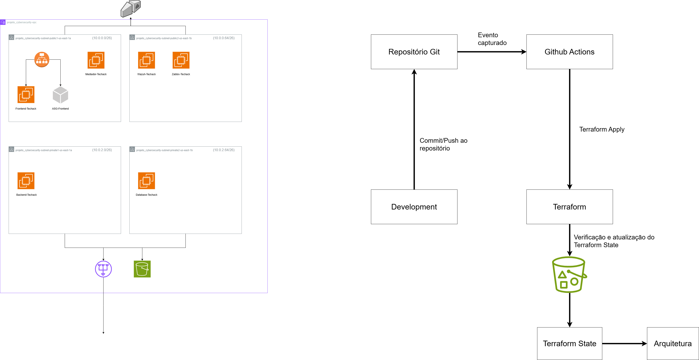

# Projeto de Hospedagem de Ambiente de Desenvolvimento Seguro na AWS com Ênfase na Segurança e CI/CD

## Objetivo do Projeto

Projetar, implementar e configurar um ambiente de desenvolvimento seguro na AWS, com alta disponibilidade, utilização de aplicações para monitoramento de segurança e consumo e automação completa de infraestrutura e pipelines de deploy.

---

## Premissas do Projeto

- Projetar um ambiente de desenvolvimento seguro na AWS
- Uso de EC2, ALB, ASG, VPC, IAM e Security Groups.
- Deploy de aplicacao dividido por funcao: frontend, backend, db.
- Monitoramento com Zabbix e analise de seguranca com Wazuh.
- Fazer todo o ambiente e testes iniciais via dashboard
- Com o ambiente estabelecido transicionar toda a infraestrutura definida como código Terraform.
- Automação CI/CD via GitHub Actions.
- Modularizacao do Terraform para facilitar reuso e expansão futura.

---

## Tecnologias Utilizadas

### AWS

- EC2
- VPC
- ALB
- Auto Scaling Group
- IAM
- S3 (para state remoto do Terraform)
- Zabbix + Wazuh

### Terraform

- Modulos por recurso
- Terraform Backend com Terraform State remoto em S3

### GitHub

- GitHub Actions para CI/CD
- Secrets para credenciais

---

## Motivações pelas escolhas

- Terraform: IaC confiável, reutilizável e que permite mudanças e adaptações da estrutura facilmente.
- EC2 + ALB + ASG: escalabilidade, disponibilidade e controle.
- GitHub Actions: CI/CD integrado ao GitHub, automação imediata.
- S3: armazenamento seguro do state remoto com versionamento.
- Zabbix/Wazuh: monitoramento e segurança ativa.

---

## Pipeline de Execução

A pipeline é executada automaticamente sempre que houver push para a branch main em arquivos da pasta ./src, ou manualmente via GitHub (workflow_dispatch).

### Fluxo:

1. Ação inicia com push na branch main.
2. Credenciais AWS são configuradas a partir dos secrets.
3. Terraform e instalado e inicializado com backend remoto.
4. terraform apply e executado com --auto-approve.

Workflow: Terraform-Techack (arquivo main.yml)

### Workflow de Destruição:

O projeto também conta com um workflow GitHub Actions separado para destruir toda a infraestrutura automaticamente via terraform destroy, garantindo reversibilidade completa.

---

## Configurações Sensíveis

Secrets configurados no repositório GitHub:

| Nome do Secret        | Finalidade                                          |
| --------------------- | --------------------------------------------------- |
| AWS_ACCESS_KEY_ID     | Chave publica de acesso AWS                         |
| AWS_SECRET_ACCESS_KEY | Chave secreta da conta AWS                          |
| AWS_BUCKET_NAME       | Nome do bucket S3 para armazenar o estado Terraform |
| AWS_BUCKET_KEY        | Caminho do arquivo .tfstate dentro do bucket        |
| AWS_BUCKET_REGION     | Regiao AWS onde o bucket foi criado                 |

---

## Diagrama da Arquitetura

O diagrama pode ser encontrado no repositório como arquivo Diagrama_Teckhack.drawio.png.

## Demonstração em Vídeo

Um vídeo demonstrativo foi criado para apresentar de forma rápida a estrutura, execução e propósito do projeto. Assim que o vídeo for hospedado, o link poderá ser adicionado abaixo:

https://youtu.be/OwwOPw-yLHY

---

## Possíveis Evoluções

- Separar ambientes dev/stage/producao
- Testes de penetração automatizados via CI/CD
- Adicionar um domínio HTTPS

---

Projeto criado para fins de avaliação da disciplina Tecnologias Hackers - Insper (2025/1).
